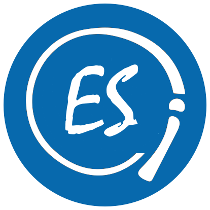

<p align="center">

<h1 align="center">ESTame</h1>

<h5 align="center">Build With Proxies - By Philip Schoeman</h5>
<h5 align="center">License : MIT</h5>
<hr/>
<h4 align="center">Powered By:</h4>
<p align="center" style="width:100%;display:inline-block">


</p?>
</p>

## Introduction

ESTame is an expandable NodeJS web development framework consisting out of multiple modules. The main ESTame module is the core framework that provides the foundation of the famework. The core ESTame module has to be extended with other ESTame modules to provide functionality.

## Getting Started

The ESTame injection module can be installed via NPM:

```javascript
npm install estame
```
The ESTame proxy can be loaded from the ESTame module:

```javascript
const estame = require("estame");
```

The estame module exports the core dependency proxy that can be extended. The ESTame dependency injection framework is at the core of the extendable nature of the ESTame framework. To read more on how the dependency injection framework, read the documentation [here](https://github.com/PhilipCoder/EStame-DependencyInjection).

## ESTame Modules

More modules to be added.